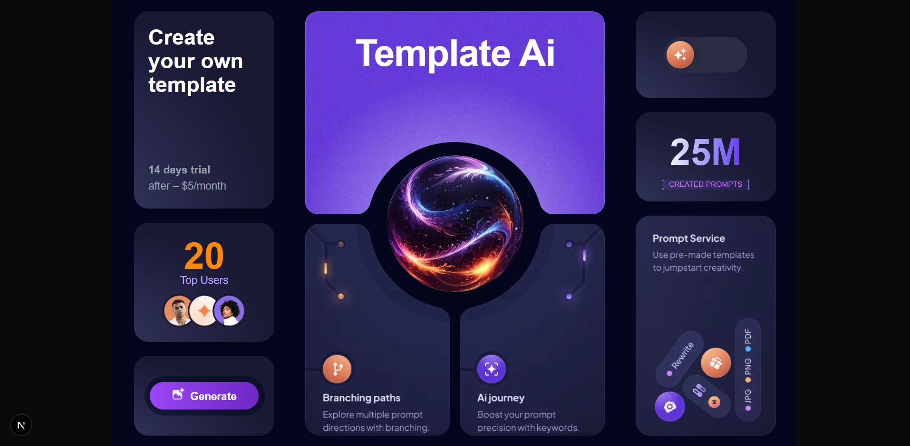

/*
* Github Link - https://github.com/prathutiwari/my-frontend-assignment
*
* 
*
* How to run your project
*    -  run npm install.
*    - nom run dev
*
* Tech stack used.
*    - Nextjs
*
* Any assumptions or decisions made.
*    - I closely followed the Figma file to build the UI and tried to match every detail as accurately as possible.
     - For the font family, I couldn't find an exact downloadable match from the shared file, so I searched by font name on Google and selected the closest available option.
     - Some assets provided in the design were not directly downloadable or usable for development:
     - For example, the branch graphics used in the card backgrounds were not available as separate image files.
     - Similarly, the text placed around a circular path could not be exported directly.
     - Due to these limitations, I used images in a few places where vector or proper design assets were unavailable. If optimized and exportable assets were provided, it would help improve both code quality and responsiveness.
     - Also, the current design is slightly complex for mobile responsiveness. Having a dedicated mobile design or more responsive-friendly layout guidelines would help implement a more adaptive experience.
*/